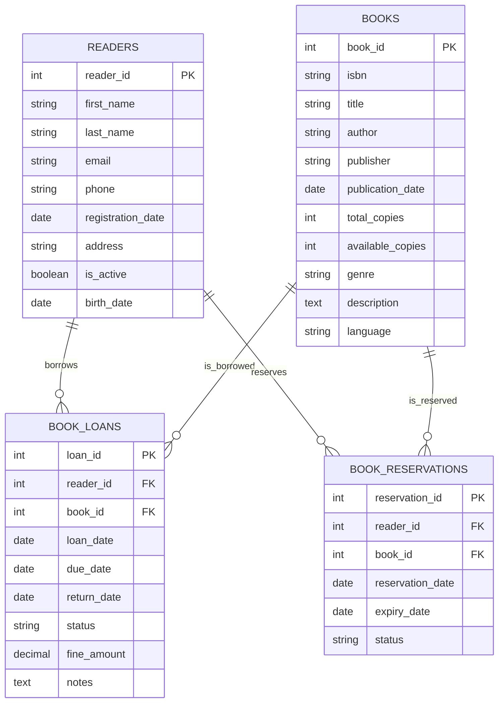
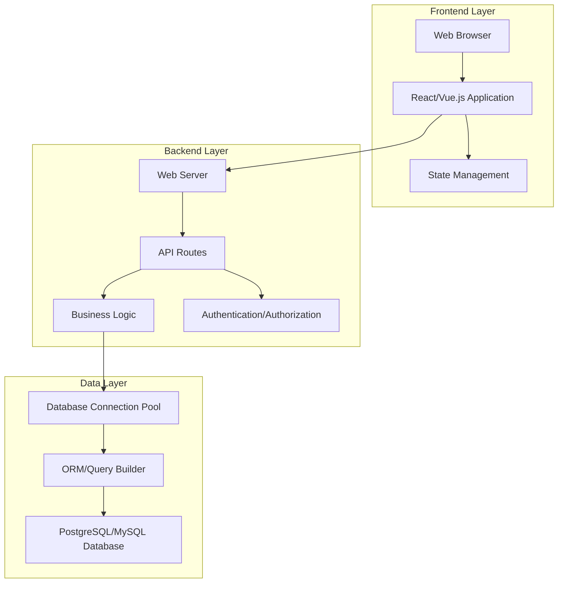
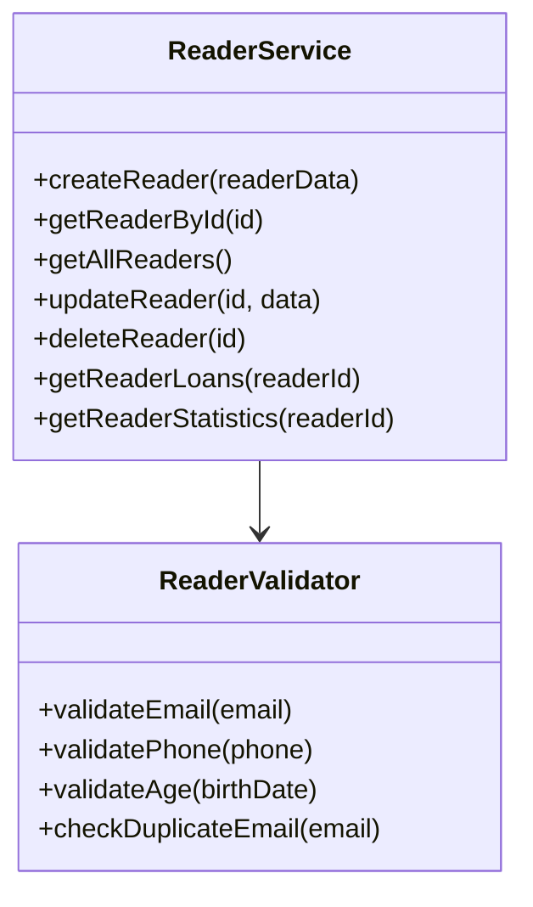
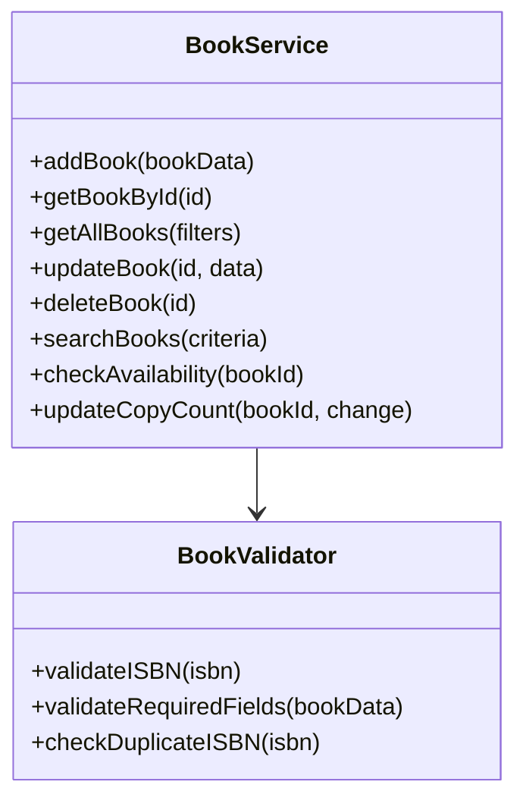
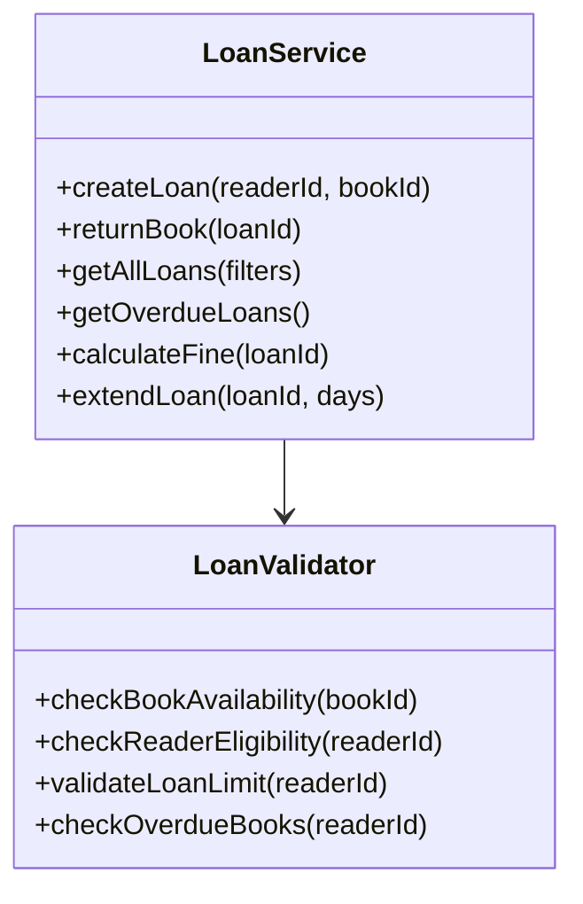
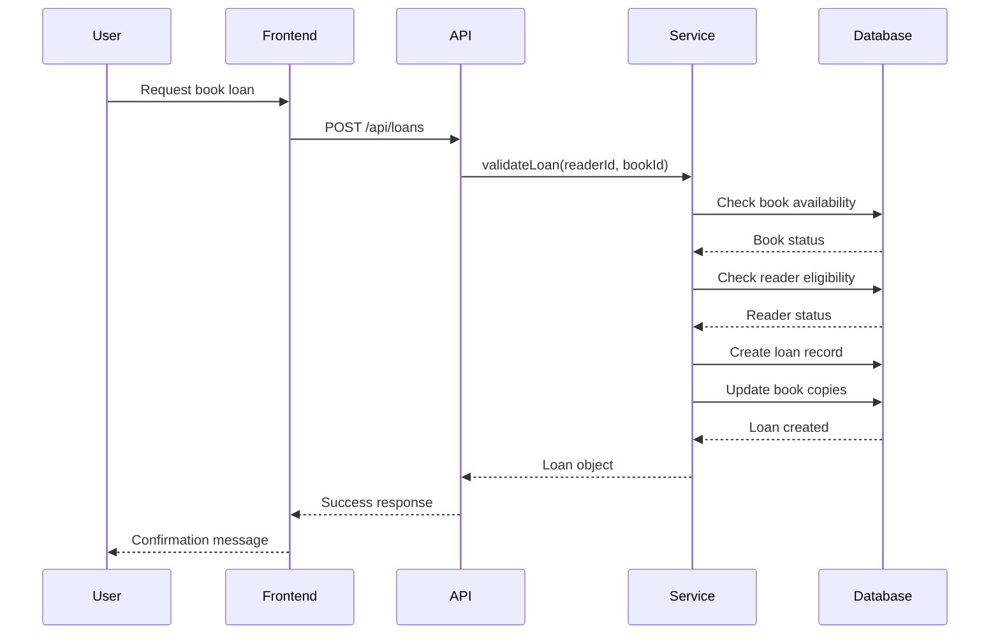
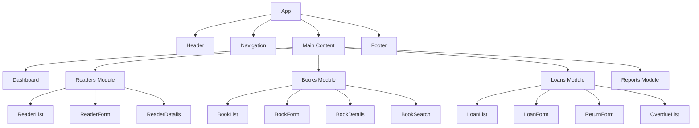
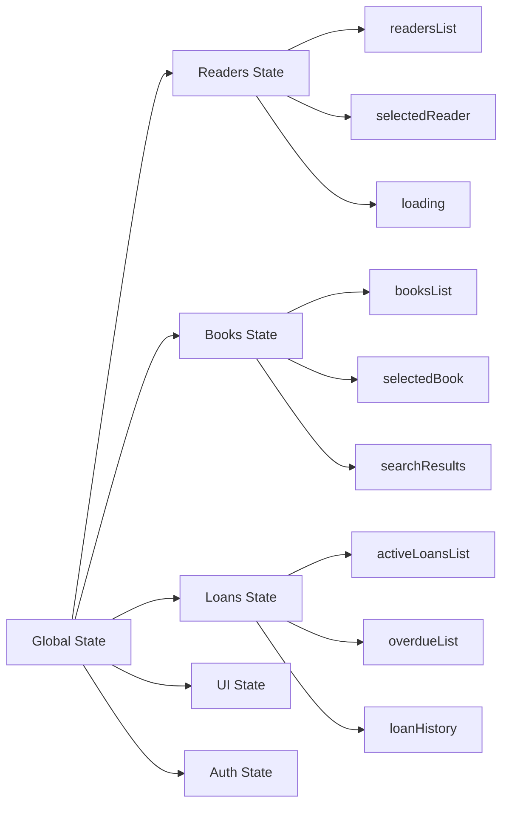
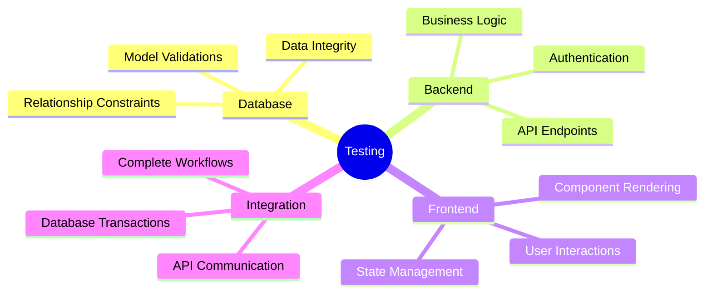

# Library Management System Design

## Overview

The Library Management System is a web application designed to manage library operations including reader information, book inventory, and book lending transactions. The system provides comprehensive tracking of library resources and user activities.

### Core Features
- Reader registration and management
- Book catalog management
- Book lending and return tracking
- Reader history and current book holdings
- Administrative reporting and analytics

### Technology Stack
- **Backend**: Web framework FastAPI
- **Database**: Relational database SQLite
- **Frontend**: Modern web framework next.js 
- **API**: RESTful API architecture

## Database Architecture

### Entity Relationship Diagram



### Table Specifications

#### READERS Table
| Field | Type | Constraints | Description |
|-------|------|-------------|-------------|
| reader_id | INT | PRIMARY KEY, AUTO_INCREMENT | Unique reader identifier |
| first_name | VARCHAR(50) | NOT NULL | Reader's first name |
| last_name | VARCHAR(50) | NOT NULL | Reader's last name |
| email | VARCHAR(100) | UNIQUE, NOT NULL | Contact email |
| phone | VARCHAR(20) | | Contact phone number |
| registration_date | DATE | NOT NULL, DEFAULT CURRENT_DATE | Account creation date |
| address | TEXT | | Reader's address |
| is_active | BOOLEAN | DEFAULT TRUE | Account status |
| birth_date | DATE | | Reader's birth date |

#### BOOKS Table
| Field | Type | Constraints | Description |
|-------|------|-------------|-------------|
| book_id | INT | PRIMARY KEY, AUTO_INCREMENT | Unique book identifier |
| isbn | VARCHAR(20) | UNIQUE | International Standard Book Number |
| title | VARCHAR(200) | NOT NULL | Book title |
| author | VARCHAR(100) | NOT NULL | Book author |
| publisher | VARCHAR(100) | | Publishing company |
| publication_date | DATE | | Publication date |
| total_copies | INT | NOT NULL, DEFAULT 1 | Total number of copies |
| available_copies | INT | NOT NULL, DEFAULT 1 | Currently available copies |
| genre | VARCHAR(50) | | Book category |
| description | TEXT | | Book description |
| language | VARCHAR(30) | DEFAULT 'Russian' | Book language |

#### BOOK_LOANS Table
| Field | Type | Constraints | Description |
|-------|------|-------------|-------------|
| loan_id | INT | PRIMARY KEY, AUTO_INCREMENT | Unique loan identifier |
| reader_id | INT | FOREIGN KEY REFERENCES READERS(reader_id) | Borrowing reader |
| book_id | INT | FOREIGN KEY REFERENCES BOOKS(book_id) | Borrowed book |
| loan_date | DATE | NOT NULL, DEFAULT CURRENT_DATE | Loan start date |
| due_date | DATE | NOT NULL | Expected return date |
| return_date | DATE | | Actual return date |
| status | ENUM('ACTIVE', 'RETURNED', 'OVERDUE') | DEFAULT 'ACTIVE' | Loan status |
| fine_amount | DECIMAL(10,2) | DEFAULT 0.00 | Late return fine |
| notes | TEXT | | Additional notes |

#### BOOK_RESERVATIONS Table
| Field | Type | Constraints | Description |
|-------|------|-------------|-------------|
| reservation_id | INT | PRIMARY KEY, AUTO_INCREMENT | Unique reservation identifier |
| reader_id | INT | FOREIGN KEY REFERENCES READERS(reader_id) | Reserving reader |
| book_id | INT | FOREIGN KEY REFERENCES BOOKS(book_id) | Reserved book |
| reservation_date | DATE | NOT NULL, DEFAULT CURRENT_DATE | Reservation creation date |
| expiry_date | DATE | NOT NULL | Reservation expiration |
| status | ENUM('ACTIVE', 'FULFILLED', 'EXPIRED', 'CANCELLED') | DEFAULT 'ACTIVE' | Reservation status |

### Database Indexes

```sql
-- Performance optimization indexes
CREATE INDEX idx_readers_email ON READERS(email);
CREATE INDEX idx_books_isbn ON BOOKS(isbn);
CREATE INDEX idx_books_title ON BOOKS(title);
CREATE INDEX idx_loans_reader_id ON BOOK_LOANS(reader_id);
CREATE INDEX idx_loans_book_id ON BOOK_LOANS(book_id);
CREATE INDEX idx_loans_status ON BOOK_LOANS(status);
CREATE INDEX idx_reservations_reader_id ON BOOK_RESERVATIONS(reader_id);
CREATE INDEX idx_reservations_book_id ON BOOK_RESERVATIONS(book_id);
```

## System Architecture

### Application Architecture Diagram



### API Endpoints Reference

#### Reader Management
| Method | Endpoint | Description | Request Body | Response |
|--------|----------|-------------|--------------|----------|
| GET | `/api/readers` | Get all readers | - | Array of readers |
| GET | `/api/readers/:id` | Get reader by ID | - | Reader object |
| POST | `/api/readers` | Create new reader | Reader data | Created reader |
| PUT | `/api/readers/:id` | Update reader | Reader data | Updated reader |
| DELETE | `/api/readers/:id` | Delete reader | - | Success message |
| GET | `/api/readers/:id/loans` | Get reader's loan history | - | Array of loans |

#### Book Management
| Method | Endpoint | Description | Request Body | Response |
|--------|----------|-------------|--------------|----------|
| GET | `/api/books` | Get all books | Query params | Array of books |
| GET | `/api/books/:id` | Get book by ID | - | Book object |
| POST | `/api/books` | Add new book | Book data | Created book |
| PUT | `/api/books/:id` | Update book | Book data | Updated book |
| DELETE | `/api/books/:id` | Delete book | - | Success message |
| GET | `/api/books/search` | Search books | Query params | Array of books |

#### Loan Management
| Method | Endpoint | Description | Request Body | Response |
|--------|----------|-------------|--------------|----------|
| GET | `/api/loans` | Get all loans | Query params | Array of loans |
| POST | `/api/loans` | Create new loan | Loan data | Created loan |
| PUT | `/api/loans/:id/return` | Return book | - | Updated loan |
| GET | `/api/loans/overdue` | Get overdue loans | - | Array of overdue loans |
| GET | `/api/loans/active` | Get active loans | - | Array of active loans |

#### Reservation Management
| Method | Endpoint | Description | Request Body | Response |
|--------|----------|-------------|--------------|----------|
| GET | `/api/reservations` | Get all reservations | Query params | Array of reservations |
| POST | `/api/reservations` | Create reservation | Reservation data | Created reservation |
| PUT | `/api/reservations/:id` | Update reservation | Reservation data | Updated reservation |
| DELETE | `/api/reservations/:id` | Cancel reservation | - | Success message |

### Business Logic Layer

#### Reader Management Service


#### Book Management Service


#### Loan Management Service


### Data Flow Architecture



## Component Architecture

### Frontend Components Hierarchy



### State Management Structure



## Authentication & Authorization

### User Roles
- **Admin**: Full system access, user management
- **Librarian**: Book and loan management, reader registration
- **Reader**: View personal information and loan history (future enhancement)

### Security Features
- JWT-based authentication
- Role-based access control
- Input validation and sanitization
- SQL injection prevention
- HTTPS enforcement

## Testing Strategy

### Unit Testing
- **Database Models**: Test CRUD operations and validations
- **Service Layer**: Test business logic and edge cases
- **API Endpoints**: Test request/response handling
- **Frontend Components**: Test component rendering and user interactions

### Integration Testing
- **Database Transactions**: Test multi-table operations
- **API Integration**: Test complete request flows
- **End-to-End Scenarios**: Test complete user workflows

### Test Coverage Areas

